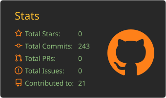
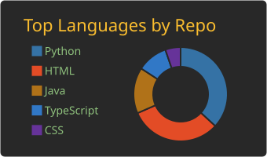
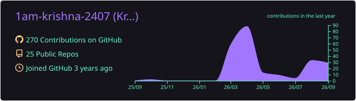
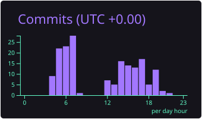

Hi, I'm Krishna Jha 👋

AI/ML • Generative AI • Software Development • Building Intelligent Systems

 

  

👨‍💻 About Me

I'm Krishna Jha, a developer focused on building practical systems at the intersection of AI/ML, Generative AI and software engineering.

My work spans machine learning, computer vision, LLM applications, RAG and predictive modeling, while also going beyond the model itself into APIs, backend systems, databases, asynchronous processing and containerized execution.

I enjoy taking an idea from a problem statement to a working application — understanding how the AI layer connects with the software system around it.

🤖 Building and experimenting with AI/ML & Generative AI applications

🧠 Exploring LLMs, RAG, prompt engineering & agentic systems

👁️ Working with Computer Vision, Deep Learning & Object Detection

⚙️ Building backend APIs, asynchronous systems & workers

🐳 Exploring Docker, MLOps & production-oriented workflows

🗄️ Working with SQL, MongoDB & data-driven applications

💻 Practicing DSA, Java & software engineering fundamentals

🚀 Turning technical ideas into end-to-end working projects

I don't want to just build a model. I want to understand the complete system around it.

🧠 What I Work With

<table>
<tr>
<td width="50%" valign="top">

🤖 AI / Machine Learning

Machine Learning

Deep Learning

Computer Vision

Generative AI

Large Language Models

Retrieval-Augmented Generation

NLP

Prompt Engineering

AI-powered Applications

Object Detection

Predictive Modeling

Model Evaluation

</td>

<td width="50%" valign="top">

💻 Software Development

Python

Java

JavaScript

C / C++

React

Node.js

REST APIs

FastAPI

HTML / CSS

Git & GitHub

Authentication

API Integration

</td>
</tr>

<tr>
<td width="50%" valign="top">

🗄️ Data & Backend

SQL

MySQL

MongoDB

Database Design

Data Handling

Backend Development

Vector Search

FAISS

Async Processing

Queues & Workers

Data Pipelines

</td>

<td width="50%" valign="top">

⚙️ Engineering & MLOps

Docker

Containerized Applications

MLOps

Model Deployment

Distributed Systems

Code Execution Systems

Secure Sandboxing

System Design Fundamentals

Automation

Problem Solving

DSA

</td>
</tr>
</table>

🛠️ Technologies

🚀 Featured Projects

I prefer building projects where AI, software engineering and infrastructure come together rather than isolated tutorials.

⚡ CodFlow — Online Code Execution Platform

A full-stack code execution platform designed around asynchronous code execution and isolated runtime environments.

The system brings together authentication, execution history, APIs, asynchronous queues, workers and Docker-based sandboxing to execute user code in a controlled environment.

Focus: Backend Async Processing Queues Workers Docker Authentication Distributed Systems

✍️ Signature & Seal Detection

A YOLOv8-powered computer vision system for automatic detection of handwritten signatures and official seals in document images.

Built using a hybrid real + synthetic dataset, the system achieved 97.1% mAP@50 and provides real-time document analysis through Streamlit.

Focus: YOLOv8 Computer Vision Deep Learning Object Detection Synthetic Data Streamlit

🧩 How I Like Building

                     REAL-WORLD PROBLEM
                             │
                             ▼
                    ┌─────────────────┐
                    │   APPLICATION   │
                    └────────┬────────┘
                             │
                             ▼
                    ┌─────────────────┐
                    │ FRONTEND / UI   │
                    └────────┬────────┘
                             │
                             ▼
                    ┌─────────────────┐
                    │  BACKEND / API  │
                    └────────┬────────┘
                             │
                  ┌──────────┴──────────┐
                  ▼                     ▼
           ┌─────────────┐       ┌─────────────┐
           │  DATABASE   │       │   AI / ML   │
           └─────────────┘       └──────┬──────┘
                                        │
                              ┌─────────┴─────────┐
                              ▼                   ▼
                       ┌────────────┐      ┌────────────┐
                       │    LLM     │      │ COMPUTER   │
                       │   / RAG    │      │   VISION   │
                       └────────────┘      └────────────┘
                              │
                              ▼
                       ┌─────────────┐
                       │ DEPLOYMENT  │
                       └──────┬──────┘
                              │
                              ▼
                         ┌─────────┐
                         │ MLOps / │
                         │ SYSTEMS │
                         └─────────┘

I'm interested in understanding how these pieces connect to turn an idea into a usable, reliable and deployable system.

Problem → Application → Intelligence → Infrastructure → Deployment

## 📊 GitHub Statistics

  
  

## 📈 GitHub Activity

  
  

## Productive-time

  
🐍 Contribution Snake

💻 Problem Solving

I'm continuously working on DSA and problem solving alongside AI and software development.

🌱 Currently Exploring

<table>
<tr>
<td width="33%" valign="top">

🤖 AI / ML

Generative AI
Large Language Models
RAG
Agentic AI
Computer Vision
Deep Learning
AI Applications

</td>

<td width="33%" valign="top">

💻 Software Engineering

Backend Development
REST APIs
Async Processing
Databases
Full-Stack Applications
Docker
System Design

</td>

<td width="33%" valign="top">

⚙️ MLOps / Systems

Model Deployment
Containerized AI
Workers & Queues
Distributed Execution
Production ML
MLOps
Automation

</td>
</tr>
</table>

⚡ Beyond the Code

🔍 I like taking an idea and figuring out how it could actually work in the real world.

🧩 I enjoy projects where AI has to interact with other parts of a software system.

🚀 I learn best by building, debugging and improving real projects.

🧠 I'm interested in the space between AI/ML and practical software engineering.

🛠️ I enjoy understanding what happens before, around and after the model.

☕ Still trying to decide whether the bug is in my code or in my understanding of the code.

🤝 Let's Connect

I'm always interested in AI/ML, Generative AI, software engineering, interesting projects and learning from other builders.

 

<a href="https://www.linkedin.com/in/krishnaaa-here">LinkedIn</a>
  •  
<a href="https://github.com/1am-krishna-2407">GitHub</a>
  •  
<a href="mailto:krishnajha2004@gmail.com">Email</a>

  

Build • Learn • Experiment • Improve

